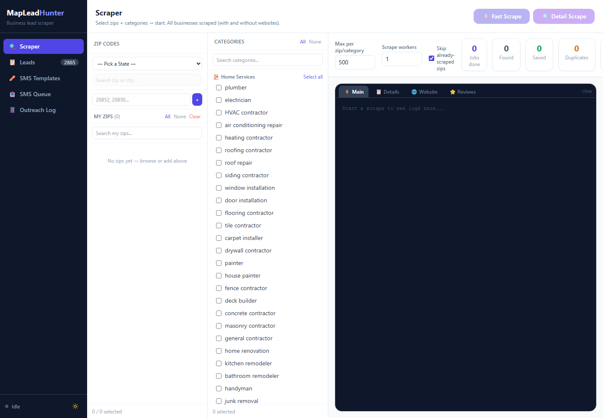

# MapLeadHunter

MapLeadHunter is a TypeScript lead-scraping dashboard for finding local businesses from Google Maps, storing them in SQLite, enriching them with details, and managing outreach workflows from one local web UI.



## Features

- Scrape Google Maps by zip code and business category
- Filter and sort leads in a local dashboard
- Store lead data in SQLite
- Re-scrape selected leads for richer business details
- Scrape business websites for emails, phones, and contact signals
- Scrape reviews for selected businesses
- Export leads to CSV
- Queue SMS outreach through a connected Android phone
- Track outreach history locally

## Tech Stack

- Node.js 24+
- TypeScript
- Playwright with stealth helpers
- Express
- SQLite via Node's built-in `node:sqlite`
- Alpine.js and Tailwind CSS for the dashboard
- Vitest for tests

## Getting Started

Install dependencies:

```bash
npm install
```

Install the Playwright browser used by the scraper:

```bash
npx playwright install chromium
```

Copy the environment example and adjust values as needed:

```bash
cp .env.example .env
```

Start the web dashboard:

```bash
npm run web
```

Open:

```text
http://localhost:3000
```

## Common Commands

```bash
npm run web          # start the dashboard
npm run scrape       # run CLI scraper command
npm run export-leads # export stored leads
npm run test         # run tests
npm run typecheck    # TypeScript check
npm run build        # compile TypeScript
```

Example CLI scrape:

```bash
npm run scrape -- --zips 90210,33101 --category "plumber"
```

Or use a CSV file:

```bash
npm run scrape -- --zips-file data/zips-input.csv --category "roofing contractor"
```

## Data And Privacy

Local runtime data is intentionally ignored by Git:

- `.env`
- `data/*.db`
- `data/maps-profile/`
- generated exports
- browser profiles and cache files

The public repository includes only source code, sample zip input, and non-secret project assets.

## Responsible Use

Scraping websites or platforms may violate their terms of service. Use this project carefully, at low volume, and only where you have the right to collect and process the data. Outreach workflows should comply with applicable laws, including consent, opt-out, and business-hour requirements.
